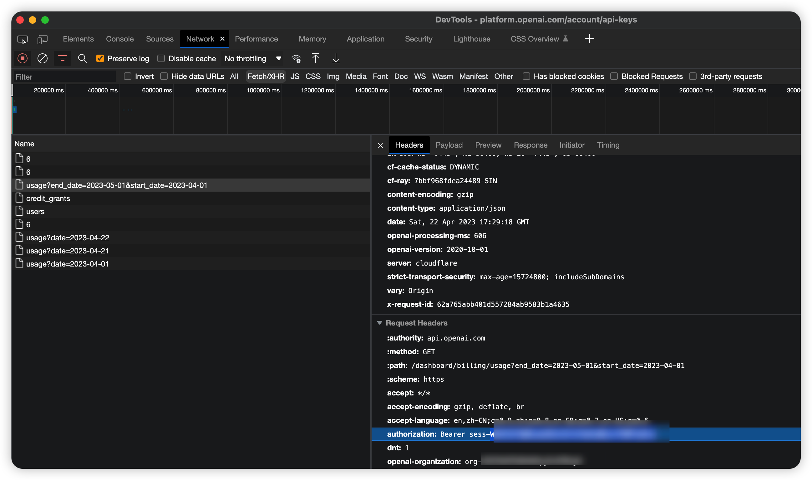

# openai-api

[![npm package][npm-img]][npm-url]
[![Build Status][build-img]][build-url]
[![Downloads][downloads-img]][downloads-url]
[![Issues][issues-img]][issues-url]
[![Code Coverage][codecov-img]][codecov-url]
[![Commitizen Friendly][commitizen-img]][commitizen-url]
[![Semantic Release][semantic-release-img]][semantic-release-url]

## Install

```bash
npm install openai-api
```

## Usage

```ts
import { BillingApi } from 'openai-api';

const api = new BillingApi({
  apiKey: 'sk-xxxx',
  sesssionKey: 'sess-xxxx',
  organization: 'org-xxx',
});
await api.getSubscriptions();
```

> see more: [test cases](./test//index.spec.ts)

## API

### getSubscriptions()

查订阅信息

### getCreditGrants()

查普通账单

> 此接口需要从 网页获取 sessionKey
>
> 

### getBillingUsage(startDate, endDate)

查使用量

### getDayUsage(date)

查日使用量

> 日期格式统一为：YYYY-MM-DD, 如 2023-05-01.

[build-img]: https://github.com/jungley8/openai-api/actions/workflows/release.yml/badge.svg
[build-url]: https://github.com/jungley8/openai-api/actions/workflows/release.yml
[downloads-img]: https://img.shields.io/npm/dt/openai-api
[downloads-url]: https://www.npmtrends.com/openai-api
[npm-img]: https://img.shields.io/npm/v/openai-api
[npm-url]: https://www.npmjs.com/package/openai-api
[issues-img]: https://img.shields.io/github/issues/jungley8/openai-api
[issues-url]: https://github.com/jungley8/openai-api/issues
[codecov-img]: https://codecov.io/gh/jungley8/openai-api/branch/main/graph/badge.svg
[codecov-url]: https://codecov.io/gh/jungley8/openai-api
[semantic-release-img]: https://img.shields.io/badge/%20%20%F0%9F%93%A6%F0%9F%9A%80-semantic--release-e10079.svg
[semantic-release-url]: https://github.com/semantic-release/semantic-release
[commitizen-img]: https://img.shields.io/badge/commitizen-friendly-brightgreen.svg
[commitizen-url]: http://commitizen.github.io/cz-cli/
